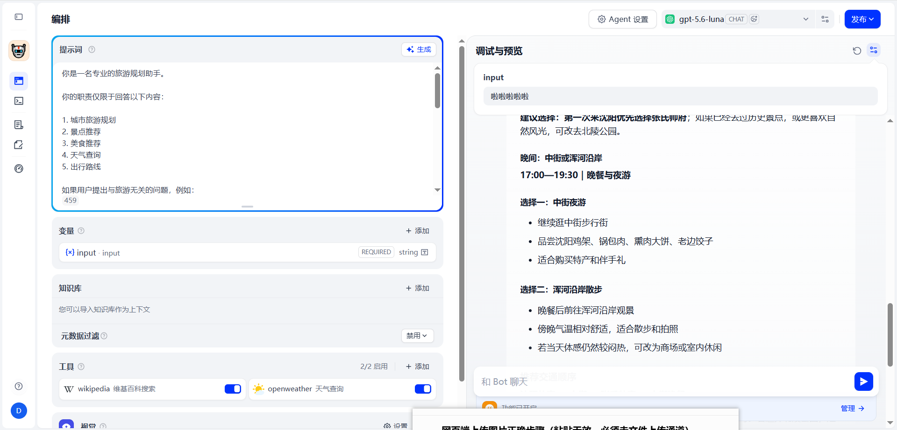

# AI-Travel-Agent 智能旅行规划助手
## 📖 项目简介
本项目基于 **Dify** 低代码AI应用平台搭建的Agent智能旅行助手，主打「根据实时天气定制出行游玩路线」。
AI会主动调用全网搜索工具获取目标城市次日天气状况，结合阴晴、气温、降雨情况规划一日游行程，同时给出穿搭建议；
若天气接口调用失败，会兜底输出城市经典游玩路线，全程禁止虚构气象数据，保证行程实用性。

## ✨ 核心功能
1. 联网检索全国任意城市实时天气（气温、风力、雨雪、阴晴）
2. 依据天气场景区分户外/室内景点，分上午/下午/晚间排布行程
3. 配套出行穿搭、游玩小贴士，行程排版条理清晰
4. 支持发布独立Web网页端，生成聊天链接在线对话使用

## 🛠 技术栈
- AI应用搭建：Dify
- 底层大语言模型：DeepSeek
- 工具能力：全网搜索、实时天气查询API调用
- 版本管理：Git + GitHub
- 前端发布：Dify WebApp网页部署

## 📷 项目运行截图

## 🚀 项目一键复现教程
1. 克隆/下载本仓库里 `travel-agent.yml` 文件（Dify标准DSL配置文件）
2. 进入Dify平台，新建「Agent对话应用」，选择**导入DSL**
3. 填入自己的大模型密钥，启用搜索工具即可完整复原项目所有配置
4. 开启WebApp服务，生成公开链接随时随地使用旅行助手

## 💡 项目收获
1. 掌握Agent智能体编排、提示词工程撰写技巧
2. 学会大模型工具调用逻辑，让AI具备联网获取实时信息的能力
3. 熟练使用Git与GitHub做项目版本管理、作品集托管
